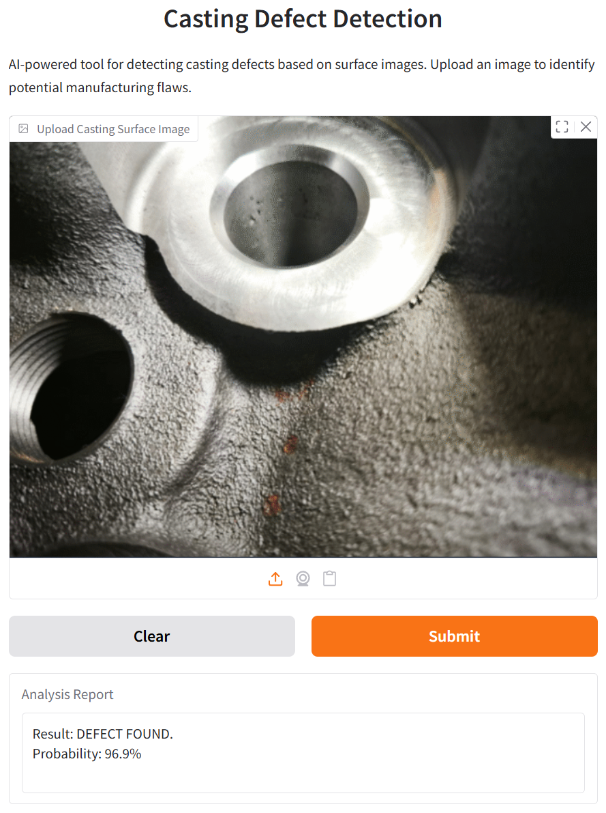

# Casting Defect Detection

An AI-powered web application for detecting defects on metal casting surfaces. This project leverages a pre-trained ResNet50 neural network to classify images as "Defect" or "Defect-Free".



## Live Demo

You can try the running application directly here:
**[Casting Defect Analyzer Live](https://gussmaker.com/research/casting-defect-analyzer/)**

---

## Overview

Quality control in foundry engineering is critical. This tool aims to automate the visual inspection process using Computer Vision.
The application provides a user-friendly web interface via [Gradio](https://gradio.app/), allowing users to upload images of castings and receive immediate feedback.

**Core Tech Stack:**
* **Python 3.8+**
* **TensorFlow/Keras:** Model inference.
* **Gradio:** Web UI.
* **ResNet50:** Underlying architecture.

## Installation & Setup

If you want to run this project locally, follow these steps:

### 1. Clone the Repository

```bash
git clone [https://github.com/YOUR_USERNAME/casting-defect-detection.git](https://github.com/YOUR_USERNAME/casting-defect-detection.git)
cd casting-defect-detection
```

### 2. Install Dependencies

It is recommended to use a virtual environment.

```bash
pip install -r requirements.txt
```

### 3. Download the Model

**Important:** Due to GitHub file size limits, the trained model is not included in this repository.

1.  Download the model files from Hugging Face: [kim1688/casting_defect_resnet50](https://huggingface.co/kim1688/casting_defect_resnet50).
2.  Create a folder named `model` in the root directory of this project.
3.  Place the downloaded model files (e.g., `saved_model.pb` and variables folder, or `.h5` file) inside the `model/` folder.

Your structure should look like this:

```text
/casting-defect-detection
    /model
        saved_model.pb
        /variables
    app.py
    requirements.txt
```

## Usage

Run the application:

```bash
python app.py
```
Open your browser and navigate to the local URL provided in the terminal (usually http://127.0.0.1:7860).

## Model Details

* **Architecture:** ResNet50
* **Input Size:** 300x300 pixels
* **Source:** The model weights were obtained from [Hugging Face User kim1688](https://huggingface.co/kim1688/casting_defect_resnet50).

## License

[MIT License](LICENSE)
